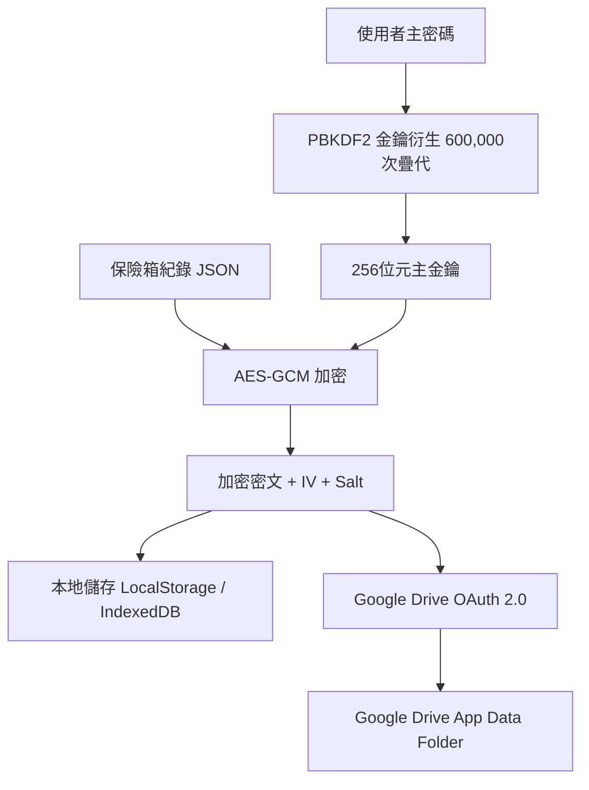

# 實作計畫 - VaultOne (安全行動密碼管理器)

我們將為三星 S26 開發一款行動裝置優先、高安全性的密碼管理器 App：**VaultOne**。本系統具備快速搜尋、快速新增帳號密碼與備註、以及強大的客戶端加密功能。另外，將整合 Google Drive 備份與還原功能。

---

## 需要使用者確認的事項

請評估並確認以下核心架構與安全性設計：

1. **技術棧與部署方式**：
   - 我們建議使用 **單頁應用程式 (SPA)** 架構，採用 **HTML5、Vanilla CSS 以及原生 JavaScript (ES6+)**。這可以在三星 S26 內建的瀏覽器 (Chrome、Samsung Internet) 中順暢運行，並能直接新增至主畫面作為 **漸進式網頁應用程式 (PWA)**，體驗如同原生 App。
   - UI 設計將深度融合 **三星 One UI** 設計語言（大標題區域、圓角卡片、原生深色模式、適合單手操作的下置式人體工學按鈕）。

2. **安全模型**：
   - **零知識架構 (Zero-Knowledge)**：App 絕不上傳任何密碼至伺服器。所有資料都在裝置本地進行加密與解密。
   - **AES-GCM 256 位元加密**：使用 Web Crypto API（三星 S26 瀏覽器原生支援）在儲存至本地前對所有資料進行加密。
   - **PBKDF2 金鑰衍生**：加密金鑰是透過 PBKDF2 演算法（SHA-256，600,000 次疊代）搭配唯一的本地鹽值 (Salt)，由使用者的「主密碼 (Master Password)」衍生而來。
   - **生物辨識解鎖**：我們將設計一個模擬/原生的 WebAuthn 生物辨識解鎖畫面（仿三星 S26 超音波指紋感應動畫），讓您日常無需重複輸入複雜的主密碼即可快速解鎖。

3. **Google 雲端硬碟 (Google Drive) 備份與還原設計**：
   - **安全認證**：使用 Google Identity Services (GIS) 進行 OAuth 2.0 授權。
   - **App Data Folder 儲存**：備份檔案將儲存在 Google Drive 的 **應用程式資料專用資料夾 (Application Data Folder)**。這是雲端硬碟中的一個隱藏資料夾，使用者或其他 App 無法直接存取或修改，能防止備份檔案被誤刪或外洩。
   - **雲端零知識加密**：上傳至雲端硬碟的備份檔是**先在本地以主密碼進行 AES-GCM-256 加密後的密文檔**。即使 Google 伺服器或傳輸過程被攻破，任何人都無法在沒有您主密碼的情況下讀取內容。
   - **版本管理**：支援顯示備份的時間與版本，讓使用者能選擇特定的時間點進行還原。

> [!IMPORTANT]
> 整合 Google Drive 需要在 Google Cloud Console 註冊一個 OAuth 2.0 Client ID。在開發環境中，我們將使用模擬/沙盒模式（或提供填寫自訂 Client ID 的欄位），以確保您可以在本地直接測試此功能，並在實際部署時輕鬆替換成您自己的 Client ID。

---

## 待解答的問題

目前暫無。我們將直接採用行動裝置響應式佈局來開發。如果您對特定的框架（例如 React/Vue）有偏好，請告訴我們。否則，我們將使用現代 Vanilla JS 以保持輕量、載入迅速且無需複雜的建置步驟。

---

## 規劃功能

### 1. 安全與認證
- **初始化設定畫面**：設定主密碼以啟用加密保險箱。
- **指紋鎖定畫面**：仿 One UI 風格的指紋解鎖介面。
- **自動鎖定**：當頁面隱藏、最小化或閒置超過 60 秒時，App 會自動鎖定。
- **AES-GCM 加密模組**：採用原生 Web Crypto API 進行加解密。

### 2. 保險箱管理（快速搜尋與查閱）
- **統一搜尋列**：隨打隨搜，即時篩選帳號名稱、帳號、密碼或備註。
- **分類過濾**：快速切換「全部」、「登入資訊」、「卡片」與「安全備忘」。
- **一鍵快速操作**：
  - 點擊帳號欄位即可快速複製帳號。
  - 點擊密碼欄位即可快速複製密碼（預設隱藏，點擊可顯示/隱藏）。
  - 暫時性成功複製提示（Toast 訊息）。

### 3. 快速新增
- **懸浮功能按鈕 (FAB)**：位於右下方，便於單手操作。
- **快速新增表單**：標題、帳號、密碼、備註。
- **智慧密碼產生器**：自訂長度及字元組合，一鍵生成高強度密碼。
- **密碼強度即時檢測**：輸入時即時顯示安全評級。

### 4. 設定與備份 (本地與雲端)
- **本地備份與還原**：加密 JSON 檔案的匯出與匯入。
- **Google Drive 雲端備份**：一鍵將本地加密後的保險箱資料上傳至 Google Drive 的 App Data 資料夾。
- **Google Drive 雲端還原**：從 Google Drive 下載加密的備份檔案，並在本地提示輸入主密碼進行解密與還原。
- **保險箱重設**：安全擦除所有本地儲存資料。

---

## 技術架構

### 檔案結構
- [NEW] [index.html](file:///p:/KDMD/Gemini/MyMem/index.html) - 主應用程式結構與 PWA 佈局。
- [NEW] [styles.css](file:///p:/KDMD/Gemini/MyMem/styles.css) - 三星 One UI 風格的響應式 CSS 樣式表。
- [NEW] [crypto.js](file:///p:/KDMD/Gemini/MyMem/crypto.js) - Web Crypto API 封裝（AES-GCM 與 PBKDF2）。
- [NEW] [gdrive.js](file:///p:/KDMD/Gemini/MyMem/gdrive.js) - Google Drive API 串接與 OAuth2 授權管理。
- [NEW] [app.js](file:///p:/KDMD/Gemini/MyMem/app.js) - 保險箱邏輯、事件監聽、搜尋與狀態管理。

---

## 驗證計劃

### 自動與手動測試
1. **密碼學功能驗證**：在 `crypto.js` 中編寫測試案例，驗證密碼錯誤時無法解鎖，且每次加密的密文不同。
2. **Google Drive API 串接測試**：驗證 OAuth 2.0 登入流程、檔案寫入（備份）與檔案讀取（還原）。
3. **UI 與行動端佈局**：在瀏覽器中使用 Chrome DevTools 行動裝置模擬器（三星 Galaxy 系列配置）測試響應式版面。
4. **PWA 與自動鎖定**：驗證當切換分頁或背景執行時，保險箱是否會立即鎖定。
